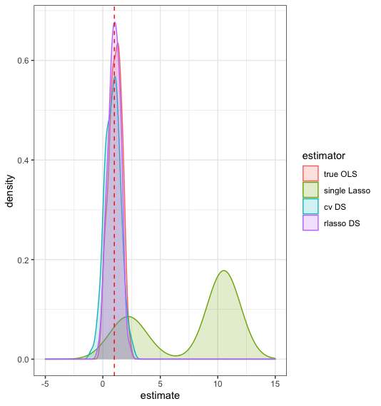
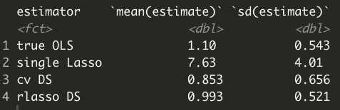
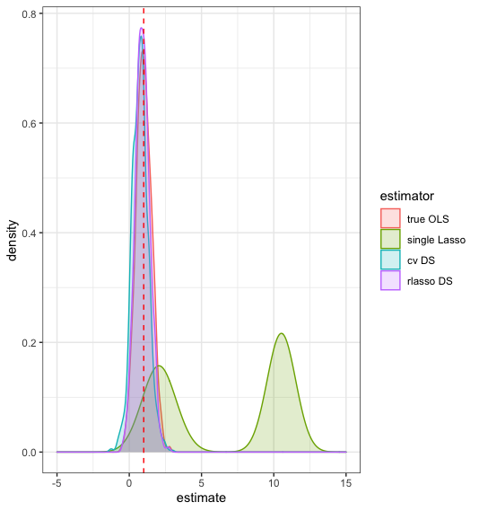
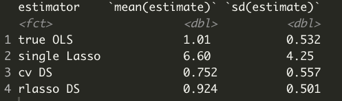
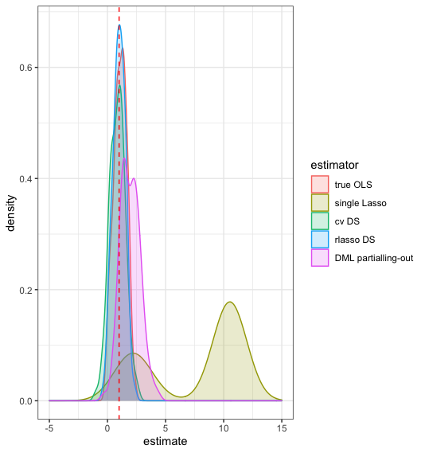
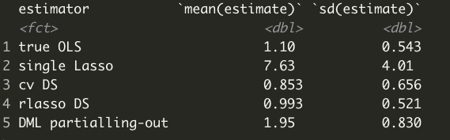

## Simple post-selection inference

```{r setup, echo=FALSE}
library("learnr") # standard package to render this tutorial
library("tidyverse") # standard package to work with data
library("glmnet") # for lasso
library("hdm") # for high-dimensional metrics 
library("broom") # for tidying up regression outputs

tutorial_options(exercise.timelimit=60*10)
dataset <- read.csv("./data/simulated_data.csv")

set.seed(2385)
Xmat <- dataset %>%  select(-y)  %>%  as.matrix()
cv_Lasso <- cv.glmnet(Xmat, dataset$y, alpha = 1)

set.seed(123)
# Store the lambda value that minimizes the validation errors
bestlam <- cv_Lasso$lambda.min
# Run Lasso
Lasso_reg <- glmnet(Xmat, dataset$y, alpha = 1, lambda=bestlam)

# Get Lasso coefficients
Lasso_coefficients <- coef(Lasso_reg) %>%
  as.matrix() %>% # Convert from Sparse matrix into a real matrix
  as.data.frame() %>% # Convert from matrix to dataframe
  mutate(coef_names = row.names(.)) %>%  # Sparse matrix saved the coefficient names as row names but we want them to be a column in the dataframe
  rename(est = s0) %>% # give a meaningful name to the column with estimates
  filter(est != 0) # filter out those variables that were not selected by Lasso

set.seed(456)
N <- 100 # Number of observations
P <- 100 # Number of potential confounders
nSim <- 100 # Number of simulations

# Simulate the potential confounders from V1 to V100, then create d and y
simulated100 <-  matrix(
  rnorm(n = N*P*nSim), # all of the potential confounders ~N(0,1)
  nrow = N*nSim, # total number of observations
  ncol = P) %>%
  as.data.frame() %>%
  mutate(
    d = V1 + V2 + V3 + 0.2*rnorm(N*nSim),
    y = 1*d + 10*V1 + 10*V2 + 10*V3 +
      10*V4 + 10*V5 + 10*V6 +
      10*V7 + 10*V8 + 10*V9 + rnorm(N*nSim),
    SimNumber = rep(c(1:nSim), each = N) # This stores the simulation number (e.g., the first 100 observations will have SimNumber = 1, the next 100 will have SimNumber = 2, and so on)
  ) %>%
  select(y, d, everything()) # This puts y and d as the first two columns.

simulated100nested <- simulated100 %>%
  group_by(SimNumber) %>%
  nest()

estimate_correctols <- function(df){
  lm(y ~ d + V1 + V2 + V3 + V4 + V5 + V6 + V7 + V8 + V9, data = df) %>%
    tidy() %>%
    filter(term == "d") %>% # We only want to store the coefficient for d
    return(.)
}


results_true <- map_dfr(.x = c(1:nSim), ~estimate_correctols(simulated100nested$data[[.x]]))

plot_estimates <- function(df){
  df %>%
    ggplot(aes(x = estimate)) +
    geom_density() +
    geom_vline(xintercept = 1, linetype = "dashed", color = "red")
}


estimate_naiveLasso <- function(data){
  # Create X matrix
  X <- data %>%  select(-y)  %>%  as.matrix()

  # Cross-validation
  cv_lasso <- cv.glmnet(X, data$y, alpha = 1)
  bestlam <- cv_lasso$lambda.min
  # Run Lasso
  lasso_reg <- glmnet(X, data$y, alpha = 1, lambda=bestlam)

  # Get Lasso coefficients
  lasso_coefficients <- coef(lasso_reg) %>%   as.matrix() %>%
    as.data.frame() %>%  mutate(coef_names = row.names(.)) %>%
    rename(est = s0) %>%
    filter(est != 0)

  # Run OLS y on d and selected control variables
  data %>% select(y, d, lasso_coefficients$coef_names[-1]) %>%
    lm(y ~ d + ., data = .) %>%  tidy() %>% filter(term == "d") %>%
    return(.)
}

set.seed(456)
# Apply estimate_naiveLasso() function using map_dfr, just like we did for OLS
results_naive_lasso <- map_dfr(.x = c(1:nSim), ~estimate_naiveLasso(data = simulated100nested$data[[.x]]))

set.seed(42)
partout_sim <- tibble(
  z = runif(n = 1000, min = 0, max = 5),
  d = 5*z + 2*rnorm(n = 1000) + rnorm(n = 1000),
  y = 10 + 2*d + 7*z + rnorm(n = 1000)
)

get_residuals <- function(dependent_var, data){
  # Create a matrix of predictors
  X <- as.matrix(data)
  # Cross-validation stage
  cv_lasso <- cv.glmnet(X, dependent_var, alpha = 1)
  bestlam <- cv_lasso$lambda.min
  # Run Lasso at best lambda
  lasso_reg <- glmnet(X, dependent_var, alpha = 1, lambda=bestlam)
  # Get Lasso coefficients
  lasso_coefficients <- coef(lasso_reg) %>%   as.matrix() %>%
    as.data.frame() %>%  mutate(coef_names = row.names(.)) %>%
    rename(est = s0) %>%
    filter(est != 0)

  # Run OLS: dependent variable  on the selected control variables
  data%>%
    mutate(dependent_var = dependent_var) %>% #add the dependent variable to the data
    select(dependent_var, lasso_coefficients$coef_names[-1]) %>% # select only the selected predictors
    lm(dependent_var ~ ., data = .) %>%  #be careful, not to use y or d notation here
    residuals(.) %>% #obtain the residuals
    return(.)
}

X <- dataset %>% select(-y,-d) %>%  as.matrix()
y_vec <- dataset$y
d_vec <- dataset$d

set.seed(123)
I  <- sample(x = c(1:N), size = N/2) %>% sort(.)
IC <- setdiff(c(1:N),I)


cv_lasso_y <- cv.glmnet(X[I,], y_vec[I], alpha = 1)
bestlam_y <- cv_lasso_y$lambda.min
lasso_y <- glmnet(X[I,], y_vec[I], alpha = 1, lambda = bestlam_y)

cv_lasso_d <- cv.glmnet(X[I,], d_vec[I], alpha = 1)
bestlam_d <- cv_lasso_d$lambda.min
lasso_d <- glmnet(X[I,], d_vec[I], alpha = 1, lambda = bestlam_d)

DML_estimator <- function(data, I, IC){
  # Create a matrix of predictors
  data %>% select(-y,-d) %>%  as.matrix() -> X
  y_vec <- data$y
  d_vec <- data$d

  # Train for y

  cv_lasso_y <- cv.glmnet(X[I,], y_vec[I], alpha = 1)
  bestlam_y <- cv_lasso_y$lambda.min
  lasso_y <- glmnet(X[I,], y_vec[I], alpha = 1, lambda = bestlam_y)

  # Train for d

  cv_lasso_d <- cv.glmnet(X[I,], d_vec[I], alpha = 1)
  bestlam_d <- cv_lasso_d$lambda.min
  lasso_d <- glmnet(X[I,], d_vec[I], alpha = 1, lambda = bestlam_d)


  # Prediction stage
  predict_y <- predict(lasso_y, newx = X[IC,], s = bestlam_y)
  predict_d <- predict(lasso_d, newx = X[IC,], s = bestlam_d)

  # Residuals

  resid_y <- y_vec[IC] - predict_y
  resid_d <- d_vec[IC] - predict_d

  mean(resid_d*resid_y)/mean(resid_d*resid_d) %>%
    return(.)
}

DML_crossfit <- function(data, I, IC){
  est1 <- DML_estimator(data, I, IC)
  est2 <- DML_estimator(data, IC, I)

  data.frame(
    estimate = 0.5*est1 + 0.5*est2
  ) %>%
    return(.)
}

```


```{r setup-public}
library("learnr") # standard package to render this tutorial
library("tidyverse") # standard package to work with data
library("glmnet") # for lasso
library("hdm") # for high-dimensional metrics 
library("broom") # for tidying up regression outputs


```
Suppose you want to run an OLS regression and you are interested in an inference task: what is the treatment effect of the variable of interest `d`  on the dependent variable `y`. However, some  other variables are potential confounders (e.g., they simultaneously affect `y` and `d`, making `d` and `y` correlated but not through the causal channel of `d` on `y`). From econometrics classes, you know that you want to control for all potential confounders. However, you realize that you have 100 potential confounders and only 100 observations. (This is actually a more common problem than you might think. Even if you have a relatively large dataset with the number of observations in millions, once you start adding all potential interaction terms between the potential confounding factors and their polynomials, you may end up with p>n )

Let's download the dataset. It is stored as a csv file in the `data` subfolder.

```{r read-data, echo=TRUE}
dataset <- read.csv("./data/simulated_data.csv")

cat("There are ", nrow(dataset), " observations in the dataset and ", ncol(dataset), " variables; namely, \n")
names(dataset)
```

As you see, the dataset contains the variables `y`, `d` and the confounders from `V1` to `V100`. The code below visualizes the average values of all variables in the dataset. It seems that all variables, including `d`, have their average within a range from -0.3 to +0.3. While `y` has its mean around -2.

Change the code below to see the standard deviations of each variable.


```{r visualize-mean, exercise=TRUE, exercise.eval=TRUE, fig.height = 3, fig.width=9}

dataset %>% 
  summarise_all(~mean(.)) %>% 
  gather(variable, mean_val) %>% 
  mutate(variable = factor(variable, levels = names(dataset))) %>% 
  ggplot(aes(x =variable, y = mean_val)) + geom_point() +
  theme(axis.text.x = element_text(angle = 90))
  
```
```{r visualize-mean-hint}

dataset %>% 
  summarise_all(~sd(.)) %>% 
  gather(variable, mean_val) %>% 
  mutate(variable = factor(variable, levels = names(dataset))) %>% 
  ggplot(aes(x =variable, y = mean_val)) + geom_point() +
  theme(axis.text.x = element_text(angle = 90))
  
```

__Question:__ What does this part of the code `mutate(variable = factor(variable, levels = names(dataset)))`  do? Why did I use it?


You ex-ante do not know which variables are important for `d` or `y`, but you are interested in the impact of `d` on `y`. 

Since, I made up the data, I can tell you that the true causal effect of `d` on `y` is 1.00.


### Run an OLS?

Let's try to run a regression with all the controls:

```{r kitchen_sink_regression, exercise=TRUE, exercise_eval=FALSE}
lm(_____put_code______) %>% tidy()
```

```{r kitchen_sink_regression-hint}
lm(y ~ ., data = dataset) %>% tidy()
```


What is happening with the estimates for standard errors?

```{r quiz-ols, echo=FALSE}
quiz(
  question("What is hapenning with the estimates for standard errors?",
    answer("standard errors cannot be calculated because of collinearity"),
    answer("standard errors cannot be calculated as the number of variables is larger than the number of observations", correct = TRUE)
))
```


What is the estimated effect of `d` on `y` without any other controls? (Hint: change the code above to find the answer)

```{r quiz-ols-coef, echo=FALSE}
quiz(
  question("What is the implied effect of d on y when not using any other controls? ",
    answer("-2.49"),
    answer("1.01"),
    answer("11.00", correct = TRUE),
    answer("11.09")
))
```

As you can see, simple OLS overestimates the true effect of `d` on `y`, as it should be equal to one.


### Lasso

Hmm, it seems this is a good use case for Lasso. Remember, that Lasso helps to select important predictors. Perhaps, Lasso can help you regress `y` on `d` simultaneously choosing correct controls for confounders.

**Fill in the blanks in the code below. ** let's try to use Lasso and cross-validation to select variables that predict y. Notice that here we do not split the sample into train-test sets. Cross-validation  will help us find the best lambda using the out-of-sample performance of Lasso at different lambdas. But we are not interested in calculating the out-of-sample MSE of the best model, as our task is not prediction.

```{r lasso, exercise = TRUE, exercise.eval=FALSE}
set.seed(2385)
# Store all the variables except the target `y` in a matrix form
Xmat <- (put code here)

# Cross-validate Lasso regression to pick the correct lambda. Use cv.glmnet() function
cv_Lasso <- cv.glmnet(Xmat, y = _____$_, alpha = _)

# Plot the results of cross-validation with plot() function
plot(_____)

```

```{r lasso-hint}
set.seed(2385)
# Store all the variables except the target `y` in a matrix form
Xmat <- dataset %>%  select(-y)  %>%  as.matrix()
# Cross-validate Lasso regression to pick the correct lambda
cv_Lasso <- cv.glmnet(Xmat, dataset$y, alpha = 1)
# Plot the results of cross-validation with plot() function
plot(cv_Lasso)
```

**Which variables did Lasso choose?** From the plot above you see that Lasso chose more than 25 variables. But which ones did it choose? Is `d` among the chosen variables? To answer these questions, you once again have to find the best lambda from `cv_lasso` object and get the coefficients of Lasso regression at the best lambda.


Now using the knowledge from the previous tutorial:
1) We extract the best lambda from `cv_Lasso`
2) Run Lasso regression on `dataset`
3) Get the coefficients at the best lambda and filter only those coefficients that have non-zero values.

**Fill in blanks in the code below**
```{r Lasso_coefs, exercise=TRUE, exercise.eval=FALSE}
set.seed(123)
# Store the lambda value that minimizes the validation errors
bestlam <- _______$lambda.min
# Run Lasso
Lasso_reg <- glmnet(_, _____$_, alpha = _, lambda=_______)

# Get Lasso coefficients
Lasso_coefficients <- coef(_____) %>%
  as.matrix() %>% # Converts from Sparse matrix into a real matrix
  as.data.frame() %>% # Converts from matrix to dataframe
  mutate(coef_names = row.names(.)) %>%  # Sparse matrix saved the coefficient names as row names but we want them to be a column in the dataframe
  rename(est = s0) %>% # give a meaningful name to the column with estimates
  filter(est != 0) # filter out those variables that were not selected by Lasso

Lasso_coefficients
```

```{r Lasso_coefs-hint}
set.seed(123)
# Store the lambda value that minimizes the validation errors
bestlam <- cv_Lasso$lambda.min
# Run Lasso
Lasso_reg <- glmnet(Xmat, dataset$y, alpha = 1, lambda=bestlam)

# Get Lasso coefficients
Lasso_coefficients <- coef(Lasso_reg) %>%
  as.matrix() %>% # Convert from Sparse matrix into a real matrix
  as.data.frame() %>% # Convert from matrix to dataframe
  mutate(coef_names = row.names(.)) %>%  # Sparse matrix saved the coefficient names as row names but we want them to be a column in the dataframe
  rename(est = s0) %>% # give a meaningful name to the column with estimates
  filter(est != 0) # filter out those variables that were not selected by Lasso

Lasso_coefficients
```


```{r quiz-lasso-naive, echo=FALSE}
quiz(
  question("How many variables did lasso choose excluding the intercept?",
    answer("28"),
    answer("27", correct = TRUE),
    answer("26"),
    answer("25")
))
```

Hooray! `d` is among the variables selected by Lasso to predict `y`. That's already a good start.
However, Lasso estimates the effect of `d` on `y` at `r Lasso_coefficients$est[Lasso_coefficients$coef_names=="d"]`, but we know that the true effect is 1. So, Lasso grossly overestimates the effect.

Wait a second! We know that Lasso  puts bias in the  coefficients on purpose in order to obtain the lowest out-of-sample MSE. No wonder that the estimator is biased. What if we run a proper OLS but with the variables selected by Lasso? This approach is called *post-selection inference*.

**Fill in blanks in the code below.** Run an OLS with `y` as dependent variable, and `d` + all other  variables that have been selected by Lasso (i.e., Lasso_coefficients):

```{r OLS_WRONGpostselection, exercise=TRUE, exercise.eval=FALSE}
dataset %>%
  select(y, d, _________) %>% #Keep only selected variables
  __(_ ~ _, data = .) %>% #Run the regression
  ____() # Show the results
```

```{r OLS_WRONGpostselection-hint}
dataset %>%
  select(y, d, Lasso_coefficients$coef_names[-1]) %>% #Keep only selected variables
  lm(y ~ ., data = .) %>% #Run the regression
  tidy() # Show the results
```

```{r quiz-postlasso-naive, echo=FALSE}
quiz(
  question("Does post-selection procedure correctly estimate that the true effect of d on y is one?",
    answer("yes"),
    answer("no, but it does not rule out that the effect is one either"),
    answer("no, and it rules out that the effect is one. What a bummer!", correct = TRUE)
))
```


Hmm... So now imagine that you did not know that the true effect equals one, cause in real life with real datasets you would not know that. Would you fall in the trap of using post-selection inference and believing that this precisely estimated 10 is the true effect? :)

Maybe you would not, maybe you would. And this is ok, many people followed this naive post-selection procedure, thinking that Lasso helps them select controls for inference problem, while in fact it does not. But now, on this simple example, you can clearly see and convince yourself that this naive post-selection approach does not work for inference.

Before we rush into the next section to try another approach to use Lasso for inference, let's first figure out what went wrong with this naive approach. And to do so, you need first to know the complete truth: how exactly I cooked `y` and `d` from the other variables. In real life you would not know the truth, but we use this simulated data to see how well our estimators are doing in such hypothetical scenarios.

The graph below shows the true causal relationships between different variables in the dataset.

{width=50%}

As you can see only ten variables impact `y`: `d` and the first nine control variables (from `V1` to `V9`). Variables `V1`, `V2`, and `V3`, also impact `d`. Hence, these three variables -- `V1`, `V2`, and `V3` -- are the true confounders in the relationship between `d` and `y`. Hence, econometric theory tells us that if we include these three variables as controls, then we should be able to calculate the true causal effect of `d` on `y`. Let's check this out.


**Write the code in the space below** to run an OLS of `y` on `d` and `V1`, `V2`, and `V3`.
```{r true-ols, exercise=TRUE, exercise.eval=FALSE}
(put your code here)
```

```{r true-ols-hint}
lm(y ~ d + V1 + V2 + V3, data = dataset) %>% tidy()
```

```{r quiz-true-ols, echo=FALSE}
quiz(
  question("Does the OLS using the variables that truly matter correctly estimate that the true effect of d on y is one?",
    answer("yes"),
    answer("no, but it does not rule out that the effect is one either", correct = TRUE),
    answer("no, and it rules out that the effect is one. What a bummer!")
))
```

Haha, I know you feel a bit disappointed that the estimate is not equal to one.  As you can see from the table above, the estimate is wrong, but the standard errors are huge as well. In fact we cannot reject the null hypothesis that the true effect is equal to one. We cannot even reject the null hypothesis that the true effect is equal to zero. After all, this is an OLS on 100 observations, things can be quite imprecise.  But hey, this OLS is at least not lying to us in the way post-selection procedure did (that the effect is precisely equal to something else than one).

So why did post-selection procedure lied to us so blatantly?

To answer this question you should revisit the variables that Lasso selected.

```{r show-lasso-coefs}
Lasso_coefficients
```

Now since you know about the true relationship between `y` and `d` and all the `V1`-`V100`, what can you conclude about Lasso?

```{r quiz-lasso-problem, echo=FALSE}
quiz(
  question("In this example:",
    answer("Lasso included only relevant variables"),
    answer("Lasso included a few irrelevant variables"),
    answer("Lasso included a lot of irrelevant variables", correct = TRUE),
    answer("Lasso omitted all of the confounding variables"),
    answer("Lasso omitted some of the confounding variable", correct = TRUE)
))
```


Well, Lasso collected lots of junk variables, and this can be a problem in itself.

However, importantly, **Lasso did not include all of the confounding variables**. Namely, it omitted V3.

In fact, in situations like this -- when you need to select variables for inference -- Lasso will be **more likely** to throw away a true confounder, rather than to include it. And if it does include all of the confounders, it will tend to throw away the treatment variable.  Why? In short, this happens because,  the confounding variable is correlated with the treatment variable. From the point of view of Lasso, it might be enough to include just one of them as both provide good prediction of `y`, while keeping both of these variables is costly (remember, we penalize the model complexity with Lasso). So the confounding variable can become a substitute to the treatment variable. Hence, Lasso, in fact, is doing something completely opposite to what we want.


## Simulation

Let's convince ourselves that the naive post-selection inference is incorrect by simulating 100 different samples from the same data generating process and estimating the naive post-selection coefficient for `d` and the true OLS of `y` on `d` and `V1` to `V9`.

The code below generates 100 samples.

```{r 100_simulations, echo = TRUE, eval=FALSE}
set.seed(456)
N <- 100 # Number of observations
P <- 100 # Number of potential confounders
nSim <- 100 # Number of simulations

# Simulate the potential confounders from V1 to V100, then create d and y
simulated100 <-  matrix(
  rnorm(n = N*P*nSim), # all of the potential confounders ~N(0,1)
  nrow = N*nSim, # total number of observations
  ncol = P) %>%
  as.data.frame() %>%
  mutate(
    d = V1 + V2 + V3 + 0.2*rnorm(N*nSim),
    y = 1*d + 10*V1 + 10*V2 + 10*V3 +
      10*V4 + 10*V5 + 10*V6 +
      10*V7 + 10*V8 + 10*V9 + rnorm(N*nSim),
    SimNumber = rep(c(1:nSim), each = N) # This stores the simulation number (e.g., the first 100 observations will have SimNumber = 1, the next 100 will have SimNumber = 2, and so on)
    ) %>%
  select(y, d, everything()) # This puts y and d as the first two columns.
```

```{r 100_simulations-see, exercise=FALSE}

# Show the dimensions of the simulated data
dim(simulated100)

# Check how it looks
simulated100 %>% head()

```

So far we created one big dataset that combines different samples together.

In the next chunk of code we use `nest()` function to split the data into 100 samples and nest those as entries to column `data` in the tibble named `simulated100nested`. [`tibble`](https://tibble.tidyverse.org/) is a cooler version of dataframes, but the most important feature of tibbles is that they can nest another objects like dataframes and other tibbles as entries. (Note: `nest()` is a cool function to prepare data for automated application of different functions.)

```{r nest, echo=TRUE, eval=FALSE}
simulated100nested <- simulated100 %>%
  group_by(SimNumber) %>%
  nest()
```


You may want to explore this new object by uncommenting some of the code below.

```{r nest-explore, exercise = TRUE}

# Check dimensions of the nested dataset with simulations
simulated100nested %>% dim()

# Check how the nested dataset looks like
# simulated100nested %>% head()

# Check that the first item in the data column  is actually a dataframe
# simulated100nested$data[[1]] %>%  class()
# simulated100nested$data[[1]] %>%  head()
```


### Run an OLS one-hundred times

To run an OLS with the true functional form on each simulated dataset:

1) We first need to create a function, which we name `estimate_correctols()`. `estimate_correctols()` should take only one argument as input -- the dataframe -- and should returns back a row with the OLS  estimates of the treatment effect.

2) Then, we apply that function on each of the 100 samples of the simulated data. We achieve it using `map_dfr()` function, instead of using a `for` loop.

a) The first argument in `map_dfr()` gives you the counter `.x` from `1` to the total number of simulations `nSim`. Remember that we can access any of the one hundred different simulations of a dataset, by subsetting it in this manner: `simulated100$data[[simulation_number]]`.

b) The last argument is the function that we want to run. In our case, it is `estimate_correctols()`, which we apply on the simulated data. Note, that the counter `.x` helps us access the corresponding simulation:  `simulated100$data[[.x]]`


```{r estimate_trueols, exercise=TRUE, exercise.eval=FALSE}
# Define the function that takes a dataframe as input `df` and runs an OLS of y on d and V1, V2, ..., V9 (the variables in that `df` object)
estimate_correctols <- function(df){
  lm(_____put_formula_____, data = __) %>%
    tidy() %>% # Outputs regression results as a dataframe
    filter(term == ___) %>% # We only want to store the coefficient for d
    return(.)
}

# Apply the function estimate_correctols() using map_dfr()  function
results_true <- map_dfr(.x = c(1:nSim), ~estimate_correctols(simulated100nested$data[[.x]]))
results_true
```

```{r estimate_trueols-hint}
# Define the function that takes a dataframe as input `df` and runs an OLS of y on d and V1, V2, ..., V9 (the variables in that `df` object)
estimate_correctols <- function(df){
  lm(y ~ d + V1 + V2 + V3 + V4 + V5 + V6 + V7 + V8 + V9, data = df) %>%
    tidy() %>% # Outputs regression results as a dataframe
    filter(term == "d") %>% # We only want to store the coefficient for d
    return(.)
}

# Apply the function estimate_correctols() using map_dfr()  function
results_true <- map_dfr(.x = c(1:nSim), ~estimate_correctols(simulated100nested$data[[.x]]))
results_true
```


Let's plot the results. I made a function `plot_estimates()` for plotting the estimation results. (Since we are going to make the same plot again later but for another estimates, it might be worth to define this code as a function).

```{r plot_function, echo = TRUE}

plot_estimates <- function(df){
  df %>%
    ggplot(aes(x = estimate)) +
    geom_density() +
    geom_vline(xintercept = 1, linetype = "dashed", color = "red")
}


```


### Exercise: Plot the distribution of OLS estimates

**Amend the code below** to plot the distribution of estimates that are stored in `results_true`. The dashed red line points to the true treatment effect.


```{r plot_trueols, exercise = TRUE, exercise.eval = FALSE}
_____________(_________)
```

```{r plot_trueols-hint}
plot_estimates(results_true)
```


```{r quiz-ols-distr, echo=FALSE}
quiz(
  question("Based on the simulation results, the OLS estimator (once we know the correct functional form) seems to",
    answer("be centered around 10"),
    answer("be centered around 1 (the true effect)  or slightly higher ", correct = TRUE),
    answer("have a relatively small spread of estimates (i.e., the estimator is precise)"),
    answer("have a relatively large spread of estimates (i.e., the estimator is not so precise)", correct = TRUE))
)
```

**Amend the code below** to get the mean and standard deviation of the estimates that are stored in `results_true`.

```{r true_ols_mean, exercise = TRUE, exercise.eval=FALSE}

_____________ %>% summarise(_____(_____), _____(_____))
```
```{r true_ols_mean-hint}
# Mean of the distribution
results_true %>% summarise(mean(estimate), sd(estimate))
```


### Run naive post-selection estimator one-hundred times

Now, let's check the distribution of coefficients in front of `d` using naive post-Lasso on those 100 different samples by applying the naive post-Lasso for each sample.

I have pre-specified the function to repeat the naive post-Lasso approach. Notice that we are forcing the treatment variable `d` to remain in the main regression independent of whether `d` is selected or not by Lasso.

```{r snaiveLasso_function}
estimate_naiveLasso <- function(data){
  # Create X matrix
  X <- data %>%  select(-y)  %>%  as.matrix()

  # Cross-validation
  cv_lasso <- cv.glmnet(X, data$y, alpha = 1)
  bestlam <- cv_lasso$lambda.min
  # Run Lasso
  lasso_reg <- glmnet(X, data$y, alpha = 1, lambda=bestlam)

  # Get Lasso coefficients
  lasso_coefficients <- coef(lasso_reg) %>%   as.matrix() %>%
    as.data.frame() %>%  mutate(coef_names = row.names(.)) %>%
    rename(est = s0) %>%
    filter(est != 0)

  # Run OLS y on d and selected control variables
  data %>% select(y, d, lasso_coefficients$coef_names[-1]) %>%
    lm(y ~ d + ., data = .) %>%  tidy() %>% filter(term == "d") %>%
    return(.)
}
```


### Exercise: Plot the distribution of naive post-Lasso estimates
**Amend the code below ** to apply the function `estimate_naiveLasso` on every sample that is stored in `simulated100nested` tibble. Also, plot the distribution of the estimates, and estimate  the mean and standard deviation of this naive post-Lasso estimator.


```{r simulate_naiveLasso_many_times, exercise = TRUE, exercise.eval=FALSE}
set.seed(456)
# Apply estimate_naiveLasso() function using map_dfr, just like we did for OLS
results_naive_lasso <- 

# Plot the results
plot_estimates(______________)

# Calculate the mean and sd of the estomates
results_naive_lasso %>% summarise(__________, ____________)
```

```{r simulate_naiveLasso_many_times-hint}
set.seed(456)
# Apply estimate_naiveLasso() function using map_dfr, just like we did for OLS
results_naive_lasso <- map_dfr(.x = c(1:nSim), ~estimate_naiveLasso(data = simulated100nested$data[[.x]]))

# Plot the results
plot_estimates(results_naive_lasso)

# Calculate the mean and sd of the estomates
results_naive_lasso %>% summarise(mean(estimate), sd(estimate))
```


As you can see, the distribution of estimates is centered around two numbers: it has a weird bump on the right tail around value 10 (by now you should know why).


>To sum up: Using Lasso to select control variables for an inference problem is a **bad idea**.
1) The objective of Lasso is prediction not estimation
2) Lasso selects the controls that best predict `y`, but does not care about `d` and omitted-variable bias problem.

What can we do to use Lasso for inference? Short answer: Double Selection selection procedure.
In order to understand the Double Selection approach for inference, we first need to take another look at the OLS, and in particular at its partialling-out properties.

## Partialling-out estimator

Note: Understanding this part is actually the key to understanding all of the "prediction tools for causal inference" models that we are going to see until the end of this course.

Let us simulate simple data, where `d` is the variable of interest, `z` is an endogenous variable, and `y` is outcome, generated according to the following data-generating process:

```{r partout, eval=FALSE}
set.seed(42)
partout_sim <- tibble(
  z = runif(n = 1000, min = 0, max = 5),
  d = 5*z + 2*rnorm(n = 1000) + rnorm(n = 1000),
  y = 10 + 2*d + 7*z + rnorm(n = 1000)
)
```

```{r simple_ols}
lm(y ~ d, data = partout_sim) %>%
  tidy()

```

Omitting `z` generates an omitted variable bias. The estimate of a coefficient corresponding to `d` is 3.3, while we know the true coefficient is 2.

```{r ols}
lm(y ~ d + z, data = partout_sim) %>%
  tidy()

```

When we include `z` as a control, the bias disappears.

### Exercise: Partial-out!

Now, let's partial out `z` from `d` and `y`.

What do I mean by partialling out? For example, you partial out `z` from `y` by regressing `y` on `z` and storing the residuals. Then, the residuals of this regression will represent the parts of `y` that are orthogonal to `z`, or in other words, the variation in `y` that is not explained by `z`.

$$y_i = \alpha_y + \beta_y z_i + \dot{y}_i $$

Then, $\dot{y}_i$ is what's left of $y_i$ after we removed all the co-movement with $z_i$.

Similarly, to partial out `z` from `d` we run the following regression:

$$d_i = \alpha_d + \beta_d z_i + \dot{d}_i $$
Then, $\dot{d}_i$ is what's left of $d_i$ after we removed all the co-movement with $z_i$.

**Complete the code below** to obtain residuals $\dot{y}$ and $\dot{d}$, which we name in the code as `y_no_z` and `d_no_z`, respectively. And then regress $\dot{y}$ on  $\dot{d}$. What is the coefficient in from of `d_no_z`? Is it equivalent to the coefficient in front of `d` in the previous regression `lm(y ~ d + z)`?

```{r partial_out, exercise = TRUE, exercise.eval=FALSE}
# Put your answer here.

d_no_z <- lm(d ~ z, data = partout_sim) %>% resid()
# 2) y_no_z <- ...
# 3) regress y_no_z on d_no_z

```

```{r partial_out-hint}

d_no_z <- lm(d ~ z, data = partout_sim) %>% resid()
y_no_z <- lm(y ~ z, data = partout_sim) %>% resid()
lm(y_no_z ~ d_no_z) %>% tidy()
```


## Double Selection procedure

So, the coefficient in front of `d` in the regression `lm(y ~ d + z)` captures any residual co-movement between `y` and `d` that cannot be explained by the co-movement of `y` with `z` and `d` with `z`.

To sum up. If  you are interested in parameter $\beta$ from the regression:

$$y_i = \alpha + \beta d_i + \gamma z_i + \epsilon_i $$

You can always rewrite the problem as a 3-step procedure:

**Step 1**

$$y_i = \alpha_y + \beta_y z_i + \dot{y}_i $$
**Step 2**
$$d_i = \alpha_d + \beta_d z_i + \dot{d}_i $$
**Step 3**
$$\dot{y}_i = \dot{\beta} \dot{d}_i$$
According to the [Frisch-Waugh-Lovell Theorem](https://bookdown.org/ts_robinson1994/10_fundamental_theorems_for_econometrics/frisch.html), we can show that
$$ \dot{\beta} = \beta$$

This identity also works when $z_i$ is a vector of controls.

But how is this partialling-out interpretation of the OLS useful for us?

Take a look at Step 1 and Step 2. In those regressions, do we care about the properties of $\alpha_y$, $\beta_y$, $\alpha_d$, and $\beta_d$? Or do we care that the errors $\dot{d}$ and  $\dot{y}$ are reasonably small? In other words, what is the purpose of Step 1 and Step 2 regressions: inference or prediction?

```{r quiz-step12, echo=FALSE}
quiz(
  question("Step 1 and Step 2 tasks are:",
    answer("Inference tasks"),
    answer("Prediction tasks", correct = TRUE)
))
```

Then, what about Step 3?

```{r quiz-step13, echo=FALSE}
quiz(
  question("Step 3 task is a:",
    answer("Inference task", correct = TRUE),
    answer("Prediction task")
))
```


### Double Selection (cross-validation) Step-by-Step

Thanks to the partialling-out interpretation of OLS we can always decompose any inference problem into **two** multivariate prediction tasks and **one** univariate inference problem. Importantly, perhaps, now we can use the prediction tools for Step 1 and Step 2, while the inference problem at the end of the procedure is now super simple.

For example, can we use Lasso with cross-validation to select variables in step 1 and step 2?

Let's find out.

Let's return back to our `dataset` which we used at the beginning of this tutorial. We will run TWO selection regressions: one for `y` and another for `d`.


**Transform the code below** to implement the double selection procedure with cross-validation. Since the task is repetitive for Step 1 and Step 2, create a function that implements that step.

```{r double_Lasso_select, exercise = TRUE, exercise.eval = FALSE}
# First finish the function that gives residuals. It should take two arguments: the vector with the dependent variable (either y or d, in our case) and the dataframe with all the potential confounders (V1 to V100, in our case)
get_residuals <- function(dependent_var, data){
  # Create a matrix of predictors
  X <-
  # Cross-validation stage
  cv_lasso <-
  bestlam <-
   # Run Lasso at best lambda
  lasso_reg <-
  # Get Lasso coefficients
  lasso_coefficients <- coef(lasso_reg) %>%   as.matrix() %>%
    as.data.frame() %>%  mutate(coef_names = row.names(.)) %>%
    rename(est = s0) %>%
    filter(est != 0)

  # Run OLS: dependent variable  on the selected control variables
   data%>%
    mutate(dependent_var = _____________) %>% #add the dependent variable to the data
    select(dependent_var, __________$_________[-1]) %>% # select only the selected predictors
    lm(_________ ~ ., data = .) %>%  #be careful, not to use y or d notation here
    _____________(.) %>% #obtain the residuals
    return(.)
}

set.seed(30)

# Step 1 y on z. Apply the function get_residuals()

resid_y <- get_residuals(dependent_var= dataset$y, data = dataset %>%  select(-y, -d))

# Step 2 d on z. Apply the function get_residuals()
resid_d <- get_residuals(dependent_var= dataset$d, data = dataset %>%  select(-y, -d))

# Step 3 resid of y on resid of d

lm(_______ ~ _______) %>%  tidy()
```

```{r double_Lasso_select-hint}

# First finish the function that gives residuals. It should take two arguments: the vector with the dependent variable (either y or d, in our case) and the dataframe with all the potential confounders (V1 to V100, in our case)
get_residuals <- function(dependent_var, data){
  # Create a matrix of predictors
  X <- as.matrix(data)
  # Cross-validation stage
  cv_lasso <- cv.glmnet(X, dependent_var, alpha = 1)
  bestlam <- cv_lasso$lambda.min
   # Run Lasso at best lambda
  lasso_reg <- glmnet(X, dependent_var, alpha = 1, lambda=bestlam)
  # Get Lasso coefficients
  lasso_coefficients <- coef(lasso_reg) %>%   as.matrix() %>%
    as.data.frame() %>%  mutate(coef_names = row.names(.)) %>%
    rename(est = s0) %>%
    filter(est != 0)

  # Run OLS: dependent variable  on the selected control variables
   data%>%
    mutate(dependent_var = dependent_var) %>% #add the dependent variable to the data
    select(dependent_var, lasso_coefficients$coef_names[-1]) %>% # select only the selected predictors
    lm(dependent_var ~ ., data = .) %>%  #be careful, not to use y or d notation here
    residuals(.) %>% #obtain the residuals
    return(.)
}

set.seed(30)

# Step 1 y on z. Apply the function get_residuals()

resid_y <- get_residuals(dependent_var= dataset$y, data = dataset %>%  select(-y, -d))

# Step 2 d on z. Apply the function get_residuals()
resid_d <- get_residuals(dependent_var= dataset$d, data = dataset %>%  select(-y, -d))

# Step 3 resid of y on resid of d

lm(resid_y ~ resid_d) %>%  tidy()

```


The double selection procedure seems to have worked exceptionally well, as the estimate is really close to the true treatment effect of 1. (Note: 9.837100e-01 is in fact 0.9837). But maybe this is just luck. Let's see how the estimates are distributed when we repeat this procedure on the 100 simulated samples from the same data-generating process.

### The distribution of the cross-validated DS-estimator

This time instead of the `map_dfr()` function, let's use an old good  `for` loop to cycle through  the samples stored in the data column of  `simulated100nested` dataset. This is just for educational purposes, so that you know both approaches.

> However, if you work with big datasets, I would advise to always use a `for` loop  rather than `map()` functions. Why? In a `for` loop you can always make the code save intermediate results after each 100th or 1000th iteration. So in case your code gets stuck at a 10000th iteration, you can restart the code where it broke, rather than start from the beginning. However, if you work with smaller datasets or the function is trivial and fast, then `map_dfr()` can be better for clarity purposes. Read more [here](https://r4ds.had.co.nz/iteration.html#the-map-functions).

**Copy the code above and paste it in the space below, adjusting when necessary.** Make sure to store the estimates of the treatment effect in step 3 for each sample. Plot the distribution.

```{r double_Lasso_select_distribution, exercise = TRUE, exercise.eval = FALSE}

# Initial a vector that will store the results
results_cvDS <- numeric(0)


set.seed(123)
for (i in c(1:___________)) {

  (Put code here)

  # Append the coefficient corresponding to resid_d to the numerical vector with all the results
  results_cvDS <- append(results_cvDS, ________)

  # Print information on which iteration is complete
  cat("iteration ", i, "complete\n")
}

results_cvDS <- data.frame(estimate=_________)
# Plot the estimates using the plot_estimates() function that we defined earlier. Don't forget that it asks for a dataframe with the results stored in a column called `estimate`
plot_estimates(________________)

# Calculate the mean and standard deviation of the estimator across 100 samples
___________________ %>% summarise(mean(estimate), sd(estimate))

```


```{r double_Lasso_select_distribution-hint}

# Initial a vector that will store the results
results_cvDS <- numeric(0)


set.seed(123)
for (i in c(1:nrow(simulated100nested))) {

  # Step 1 y on z. Apply the function get_residuals()

  resid_y <- get_residuals(dependent_var= simulated100nested$data[[i]]$y,
                           data = simulated100nested$data[[i]] %>%  select(-y, -d))

  # Step 2 d on z. Apply the function get_residuals()
  resid_d <- get_residuals(dependent_var= simulated100nested$data[[i]]$d,
                           data = simulated100nested$data[[i]] %>%  select(-y, -d))

  # Step 3 resid of y on resid of d
  # Collect the coefficients
  step3_coefs <- lm(resid_y ~ resid_d) %>% coefficients()

  # Append the coefficient corresponding to resid_d to the numerical vector with all the results
  results_cvDS <- append(results_cvDS, step3_coefs[2])

  # Print information on which iteration is complete
  cat("iteration ", i, "complete\n")
}

results_cvDS <- data.frame(estimate=results_cvDS)
# Plot the estimates using the plot_estimates() function that we defined earlier. Don't forget that it asks for a dataframe with the results stored in a column called `estimate`
plot_estimates(results_cvDS)

# Calculate the mean and standard deviation of the estimator across 100 samples
results_cvDS%>% summarise(mean(estimate), sd(estimate))

```

The results are much better compared to what we get when using post selection procedure naively. However, this estimator seems somewhat downward biased with higher standard errors than what we get when we estimated OLS with correct functional form.

As it appears that there is a theoretical explanation to why using this exact approach results in a downward bias. And the culprit is the cross-validation procedure. Apparently, even after transforming a complicated inference task into two simple prediction tasks, you cannot use  the standard cross-validation approach for those two prediction tasks. Hence, the double selection procedure needs to be tweaked even further in order to provide unbiased results for the inference problem at Step 3.

One way to do so, is to use the double-selection procedure based on **Rigorous Lasso**, which uses   theory-based choice of lambda, rather than searching lambda through cross-validation. Another alternative is to use Double Machine Learning approach (which we will see after the Double-Selection approach).

## Double-Selection + Rigorous Lasso

Post-Double-Selection estimation approach is developed by [Alexandre Belloni, Victor Chernozhukov, and Christian Hansen](https://academic.oup.com/restud/article-abstract/81/2/608/1523757?redirectedFrom=PDF).

These authors also created an R package [`hdm` package](https://github.com/cran/hdm/blob/master/DESCRIPTION)  for high-dimensional metrics (hdm), and `rlassoEffect()` function from this package implements the Double Selection procedure. `rlassoEffect()` uses Rigorous Lasso, which implements theory-based search for lambda, instead of cross-validation.


```{r hdm_doubleselection}
result_rle <- rlassoEffect(
  x = dataset %>%  select(-y, -d) %>%  as.matrix(),
  y = dataset$y,
  d = dataset$d,
  method = "partialling out")
summary(result_rle)$coefficients
```

### Exercise: The distribution of the DS estimator based on rigorous Lasso

```{r estimate100_rlassoDS, exercise = TRUE, exercise.eval=FALSE}
# Define a function that estimates the post-double-selection estimator using rlassoEffect() function, which we want to apply to each simulated sample
estimate_rlassoDS <- function(data){
  # Apply rlassoEffect function to the data
  res <- rlassoEffect(
    x = ______________,
    y = ______________,
    d = ______________,
    method = _____________)

  # Return the matrix of estimated coefficients as a dataframe
  summary(____)$__________ %>%
    as.data.frame() %>%
    return(.)
}


# Estimate the post-double-selection estimator on all of the 100 samples stores in the `data` column of the `simulated100nested` dataframe
results_rle <- map_dfr(  ___put_code_here___)

# See the names of variables in results_rle
names(results_rle)

# Rename column `Estimate.` into `estimate`
results_rle <- results_rle %>%
  rename(estimate = Estimate.)

# Plot estimates using the function plot_estimates()
___put_code_here___


# Show mean and sd of the estimates
___put_code_here___

```

```{r estimate100_rlassoDS-hint}
# Define a function that estimates the post-double-selection estimator using rlassoEffect() function, which we want to apply to each simulated sample
estimate_rlassoDS <- function(data){
  # Apply rlassoEffect function to the data
  res <- rlassoEffect(
  x = data %>%  select(-y, -d) %>%  as.matrix(),
  y = data$y,
  d = data$d,
  method = "partialling out")

  # Return the matrix of estimated coefficients as a dataframe
  summary(res)$coefficients %>%
    as.data.frame() %>%
    return(.)
}


# Estimate the post-double-selection estimator on all of the 100 samples stores in the `data` column of the `simulated100nested` dataframe
results_rle <- map_dfr(.x = c(1:nSim), ~estimate_rlassoDS(data = simulated100nested$data[[.x]]))

# See the names of variables in results_rle
names(results_rle)

# Rename column `Estimate.` into `estimate`
results_rle <- results_rle %>%
  rename(estimate = Estimate.)

# Plot estimates using the function plot_estimates()
plot_estimates(results_rle)


# Show mean and sd of the estimates
results_rle %>% summarise(mean(estimate), sd(estimate))


```

## Comparison

Let's compare all the results that we got so far: naive post-Lasso vs cross-validated DS vs rigorous DS vs the true distribution

The code below combines all of the results for different estimators together and produces the following plot and table.

```{r comparing_estimators, echo = TRUE, eval = FALSE}
results_all <- bind_rows(
  results_naive_lasso     %>%  select(estimate) %>% mutate(estimator = "single Lasso"),
  results_cvDS      %>%  select(estimate) %>% mutate(estimator = "cv DS"),
  results_rle  %>%  select(estimate) %>% mutate(estimator = "rlasso DS"),
  results_true      %>%  select(estimate) %>% mutate(estimator = "true OLS"),
) %>%
  mutate(estimator = factor(estimator, levels = c("true OLS", "single Lasso", "cv DS", "rlasso DS")))


results_all %>%
  ggplot(aes(x = estimate, fill = estimator, color = estimator)) +
    geom_density(alpha = 0.2) +
    geom_vline(xintercept = 1, linetype = "dashed", color = "red") +
  theme_bw() + xlim(-5,15)

results_all %>%
  group_by(estimator) %>%
  summarise(mean(estimate), sd(estimate))

```

{width=75%}


{width=50%}

It seems that `rlasso DS` estimator is doing better than the `true OLS` estimator, where the latter seems to be biased upwards.
However, these results are based only on 100 simulations. This is a small sample of estimates. We actually need much more simulations to approximate the true distribution for each estimator.


**Results based on 1000 simulations**

If we repeat the whole code but for 1000 simulated samples, we can see that the `true OLS` estimator is indeed centered around 1 (the true effect), while there is still some downward bias in the `rlasso DS` estimator (it is centered around 0.92 instead of 1).

{width=75%}


{width=50%}


Nevertheless, take a moment to appreciate the fact that the post-double-selection estimator based on Rigorous Lasso is able to provide a close-to-correct distribution of estimates, despite the fact that we DID NOT give it any hints about the true functional form.

We knew which variables were the true confounders, while the double selection procedure found them by itself!

Also we had too many potential confounders that we could not even run a simple OLS! Fortunately, the double selection procedure solved this problem for us: it transformed a hard multidimensional problem into a chain of simpler tasks.


>**Bottomline:** Never use the naive model selection approach  for inference.  Use the double selection approach based on rigorous Lasso (not on cross-validated Lasso)

**Things to explore:** If you are still full of energy, you can use this simulation approach to study the behavior of these different estimators (naive post-selection estimator, double selection based on cross-validated Lasso, double selection based on Rigorous Lasso) in greater detail.

For your convenience, I copied  the main code from this tutorial into an R script called `clean_code.R` in the folder of this tutorial on GitHub. Check whether the answers you find in this tutorial change as:

1) the number of predictors increase (make a grid of different values of `P`)
2) the number of variables that are important for the assignment of treatment decreases/increases (i.e., in our example `d` depended only on `V1`, `V2`, and `V3`). See whether removing/adding more variables to the data-generating process for `d` will change the distributions of the estimators.
3) the size of the treatment effect lowers or increases (in our example it was 1, does anything change if it drops to 0.1, or increases to 10?).

## Move to: Video lecture

Before we go into the details of using the Double Machine Learning estimator, it would be great to first get some theoretical explanation behind it.

So, now it is time to take a break and watch the video lectures.

After the theoretical part on the Double Machine Learning you can return back to this tutorial to continue with its last part.


## Double Machine Learning

Now, you have covered the theoretical explanation on the regularization bias and how Double de-biased Machine Learning approach can help with it.

Let's implement the DML estimator. First, you will write the code to get a DML estimate for the `dataset`. Then, you will transform the code into a function to automate the DML estimation on any new data. Finally, you will apply that function 100 times on 100 samples which are stored in `simulated100nested$data` and plot the results.

### Exercise: Estimate DML estimator for one dataset

First of all let's convert the predictors into a matrix, and store the outcome and treatment variables as separate vectors.

**Finish the code below**
```{r dml-get-vars, exercise=TRUE, exercise.eval=FALSE}
X <- dataset %>%
y_vec <-
d_vec <-

```


```{r dml-get-vars-hint}
X <- dataset %>% select(-y,-d) %>%  as.matrix()
y_vec <- dataset$y
d_vec <- dataset$d

```


Split the data into two equally-sized samples: an auxiliary (`I`) and main (`IC`) samples

```{r split-data, exercise = TRUE, exercise.eval=FALSE}
set.seed(123)
I  <- sample(x = _____, size = ____) %>% sort(.)
IC <- setdiff(____,_)
```

```{r split-data-hint}
set.seed(123)
I  <- sample(x = c(1:N), size = N/2) %>% sort(.)
IC <- setdiff(c(1:N),I)
```


Train Lasso model on the auxiliary sample to predict `y` from the predictors (excluding the treatment variable `d`). Find the best lambda and train the lasso model at the best lambda.

```{r dml-predict-y, exercise=TRUE, exercise.eval = FALSE}
  # Train lasso for y
  cv_lasso_y <- cv.glmnet(____, ____, alpha = _)
  bestlam_y <-
  lasso_y <-
```

```{r dml-predict-y-hint}
  # Train lasso for y
  cv_lasso_y <- cv.glmnet(X[I,], y_vec[I], alpha = 1)
  bestlam_y <- cv_lasso_y$lambda.min
  lasso_y <- glmnet(X[I,], y_vec[I], alpha = 1, lambda = bestlam_y)
```


Now train Lasso to predict `d`.

```{r dml-predict-d, exercise=TRUE, exercise.eval = FALSE}
  # Train lasso for y
  cv_lasso_d <- cv.glmnet(____, ____, alpha = _)
  bestlam_d <-
  lasso_d <-
```

```{r dml-predict-d-hint}
  # Train lasso for y
  cv_lasso_d <- cv.glmnet(X[I,], d_vec[I], alpha = 1)
  bestlam_d <- cv_lasso_d$lambda.min
  lasso_d <- glmnet(X[I,], d_vec[I], alpha = 1, lambda = bestlam_d)
```


Finally, predict `y` and `d` for the main sample, obtain the residuals and estimate the DML estimator:

```{r dml-laststep, exercise = TRUE, exercise.eval=FALSE}
# Prediction stage
predict_y <- predict(_______, newx = _____, s = ______)
predict_d <- predict(_______, newx = _____, s = ______)

# Get the residuals
resid_y <-
resid_d <-

# DML estimator
mean(______*______)/mean(______*_____)
```

```{r dml-laststep-hint}
# Prediction stage
predict_y <- predict(lasso_y, newx = X[IC,], s = bestlam_y)
predict_d <- predict(lasso_d, newx = X[IC,], s = bestlam_d)

# Get the residuals
resid_y <- y_vec[IC] - predict_y
resid_d <- d_vec[IC] - predict_d

# DML estimator
mean(resid_d*resid_y)/mean(resid_d*resid_d)
```

### Exercise: Create a cross-fitted DML estimator function

First of all, convert the code from the previous exercise into a single function. Then, create a second function that will implement the cross-fitting: i.e., it will first provide the DML estimate when `I` is an auxiliary sample and `IC` is a main sample, then it will swap the auxiliary and main samples to get a second DML estimate based on `IC` as the auxiliary sample and `I` as the main sample. The cross-fitted DML estimator is the average of the two DML estimators.

**Create a function that provides a DML estimate given an auxiliary and main samples.** Check whether the function works by applying it on the `dataset`.

```{r dml-function1, exercise=TRUE, exercise.eval = FALSE}

DML_estimator <- function(data, I, IC){
  # Create a matrix of predictors, also y_vec and d_vec


  # Train Lasso for y


  # Train Lasso for d


  # Prediction stage


  # Residuals


  # DML estimation formula
  _______________________________%>%
    return(.)
}

DML_estimator(data = dataset, I = I, IC = IC) # You should get the same result as earlier

```

```{r dml-function1-hint}

DML_estimator <- function(data, I, IC){
  # Create a matrix of predictors, also y_vec and d_vec
  data %>% select(-y,-d) %>%  as.matrix() -> X
  y_vec <- data$y
  d_vec <- data$d

  # Train Lasso for y

  cv_lasso_y <- cv.glmnet(X[I,], y_vec[I], alpha = 1)
  bestlam_y <- cv_lasso_y$lambda.min
  lasso_y <- glmnet(X[I,], y_vec[I], alpha = 1, lambda = bestlam_y)

  # Train Lasso for d

  cv_lasso_d <- cv.glmnet(X[I,], d_vec[I], alpha = 1)
  bestlam_d <- cv_lasso_d$lambda.min
  lasso_d <- glmnet(X[I,], d_vec[I], alpha = 1, lambda = bestlam_d)


  # Prediction stage
  predict_y <- predict(lasso_y, newx = X[IC,], s = bestlam_y)
  predict_d <- predict(lasso_d, newx = X[IC,], s = bestlam_d)

  # Residuals

  resid_y <- y_vec[IC] - predict_y
  resid_d <- d_vec[IC] - predict_d

  # DML estimation formula
  mean(resid_d*resid_y)/mean(resid_d*resid_d) %>%
    return(.)
}

DML_estimator(data = dataset, I = I, IC = IC) # You should get the same result as earlier

```


**Create a function that cross-fits the DML and provides the average of the two DML estimates.** Check whether this function works by applying it on the `dataset`.

```{r dml-cross-fit, exercise=TRUE, exercise.eval=FALSE}
DML_crossfit <- function(data, I, IC){
  est1 <-
  est2 <-

  data.frame(
    estimate = 0.5*est1 + 0.5*est2
  ) %>%
    return(.)
}

DML_crossfit(data = dataset, I = I, IC = IC)
```


```{r dml-cross-fit-hint}
DML_crossfit <- function(data, I, IC){
  est1 <- DML_estimator(data, I, IC)
  est2 <- DML_estimator(data, IC, I)

  data.frame(
    estimate = 0.5*est1 + 0.5*est2
  ) %>%
    return(.)
}

DML_crossfit(data = dataset, I = I, IC = IC)
```


**Apply the DML cross-fitting function** on 100 samples that are stored in `simulated100nested$data`. Plot the distribution of the estimates and get the mean and standard deviation of the estimates.

```{r dml-apply, exercise=TRUE, exercise.eval=FALSE}
set.seed(456)
results_DML <-

# Plot the estimates using the plot_estimates() function that we defined earlier.
plot_estimates(__________)

# Calculate the mean and standard deviation of the estimator across 100 samples
results_DML %>% (add code)


```

```{r dml-apply-hint}
set.seed(456)
results_DML <- map_dfr(.x = c(1:nSim), ~DML_crossfit(data = simulated100nested$data[[.x]], I=I, IC=IC))

# Plot the estimates using the plot_estimates() function that we defined earlier.
plot_estimates(results_DML)

# Calculate the mean and standard deviation of the estimator across 100 samples
results_DML %>% summarise(mean(estimate), sd(estimate))

```


Does DML do a good job?

## Final comparison

Now we can finally compare all the estimators together, including the DML estimator.

```{r final-comparison, echo=TRUE, eval=FALSE}
results_all <- bind_rows(
  results_naive_lasso     %>%  select(estimate) %>% mutate(estimator = "single Lasso"),
  results_cvDS      %>%  select(estimate) %>% mutate(estimator = "cv DS"),
  results_rle  %>%  select(estimate) %>% mutate(estimator = "rlasso DS"),
  results_DMLcf  %>%  select(estimate) %>% mutate(estimator = "DML partialling-out"),
  results_true      %>%  select(estimate) %>% mutate(estimator = "true OLS"),
) %>%
  mutate(estimator = factor(estimator, levels = c("true OLS", "single Lasso", "cv DS", "rlasso DS",  "DML partialling-out")))


results_all %>%
  ggplot(aes(x = estimate, fill = estimator, color = estimator)) +
  geom_density(alpha = 0.2) +
  geom_vline(xintercept = 1, linetype = "dashed", color = "red") +
  theme_bw() + xlim(-5,15)

results_all %>%
  group_by(estimator) %>%
  summarise(mean(estimate), sd(estimate))
```

{width=75%}


{width=50%}

```{r quiz-comparison-final, echo=FALSE}
quiz(
  question("In this particular example,  the best performing estimator is:",
    answer("the post-Lasso  estimator"),
    answer("the post-double-selection  estimator based on cross-validation"),
    answer("the post-double-selection  estimator based on Rigorous Lasso", correct = TRUE),
    answer("the Double Machine Learning estimator based on the cross-validated Lasso")
))
```

Why do you think DML performs poorly in this setting?

**Home exercise: ** Try to estimate the DML based on random forest. Would this help or worsen the estimates? Why?


